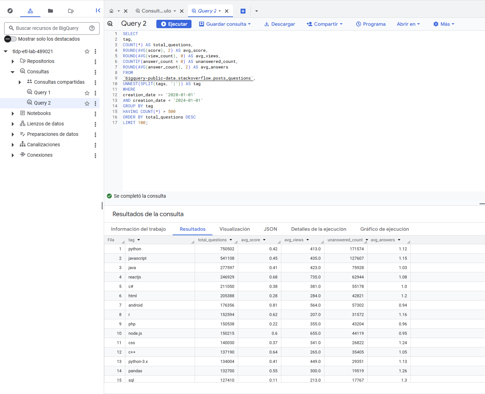
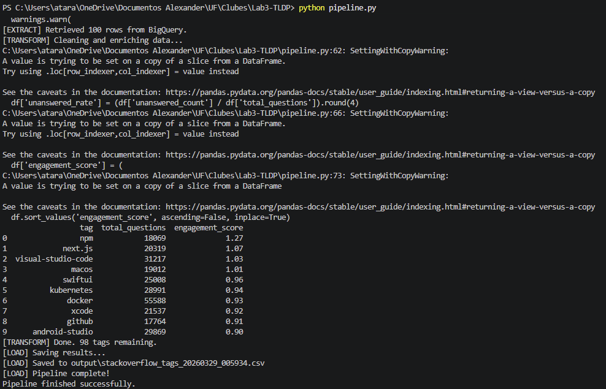

# Lab3-TLDP

# Stack Overflow Tag ETL Pipeline

# Project Description: This project builds a Python ETL pipeline that extracts data from BigQuery, transforms it using pandas, and loads the results into a timestamped CSV file for analysis.

# How to run the project:
#   git clone https://github.com/alextarassiouk/Lab3-TLDP.git
#   pip install -r requirements.txt
#   gcloud auth application-default login
#   python pipeline.py

# Pipeline Architecture
#   Extract: Query Stack Overflow data from BigQuery
#   Transform: Clean data, remove noise, create metrics
#   Load: Save processed data to CSV with timestamp

# Questions from Task 7
#   Q1: The tag with the highest engagement score is npm with 1.27. This tags performs this highly because it is extremely popular and has a very active community.
#   Q2: I believe that the tag with the highest unsanswered rate is visual-studio-code with 0.3518. My guess would be that this is the most niche topic; therefore, it has less responses from the community.
#   Q3: Using BigQuery allows me to work with huge datasets. If I were to download the data to my local computer, I would be limited by the memory of my device.
#   Q4: A product manager could use this data to identigy trending topics and which ones are left unanswered the most. With this information, a product manager could prioritize some content over others or improve documentation on a specific topic.

